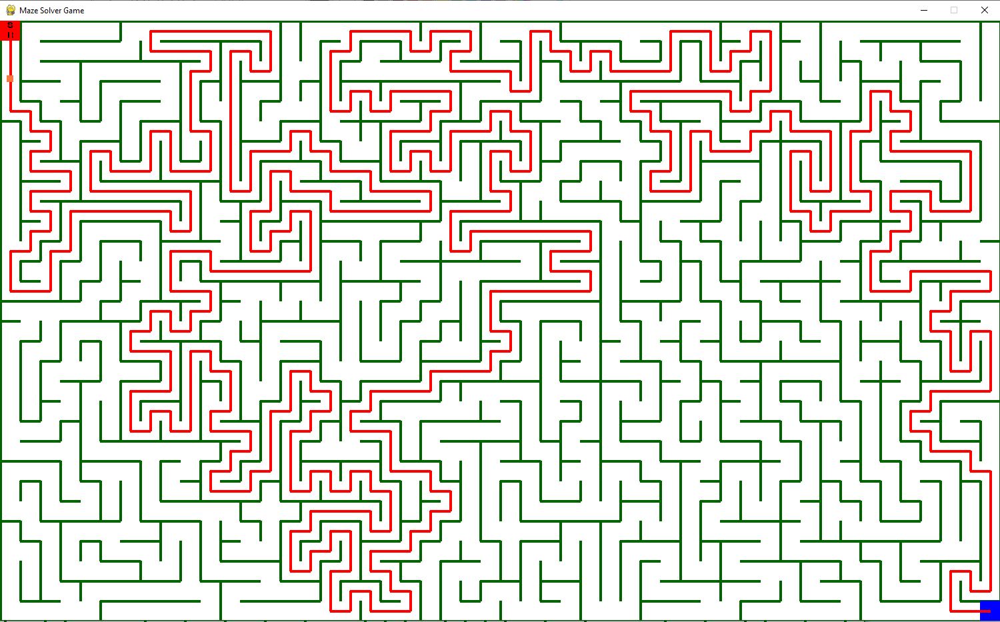

# Pygame Maze Solver
This repository contains a Python script that generates a maze using the Pygame library and provides functionality to solve the maze using a pathfinding algorithm.

</img>

# Features
1. Maze generation: The script generates a maze with a specified number of columns and rows using a randomized algorithm.
2. Maze solving: It implements a pathfinding algorithm to find and display the solution path from the start position to the end position in the maze.
3. Interactive gameplay: The user can navigate the maze using the arrow keys and control a player character represented by a colored rectangle.
4. Menu options: The script provides menu buttons to solve the maze automatically or reset it for a new challenge.

</img>
# Installation
1. Ensure that you have Python installed on your system (version 3.7 or above).
2. Clone this repository to your local machine or download the script file (maze_solver.py) directly.
3. Install the required dependencies by running the following command: <code> pip install pygame</code>
4. Run the script using the following command:
<code>python maze_solver.py</code>
# Usage
 ### Use the arrow keys to navigate the player character through the maze.
 ### Press the "S" button in the menu to automatically solve the maze using a pathfinding algorithm.
 ### Press the "R" button in the menu to reset the maze and start a new game.
# Dependencies
The script depends on the following Python libraries:

 #### Pygame: Used for graphics and user interaction. Install using <code>pip install pygame</code>.

# License
This project is licensed under the MIT License.

# Acknowledgements
The maze generation and pathfinding algorithms are based on classic algorithms and adapted for use in this script.
The Pygame library provides the foundation for the graphical interface and user interaction.
Feel free to contribute, report issues, or suggest improvements.
